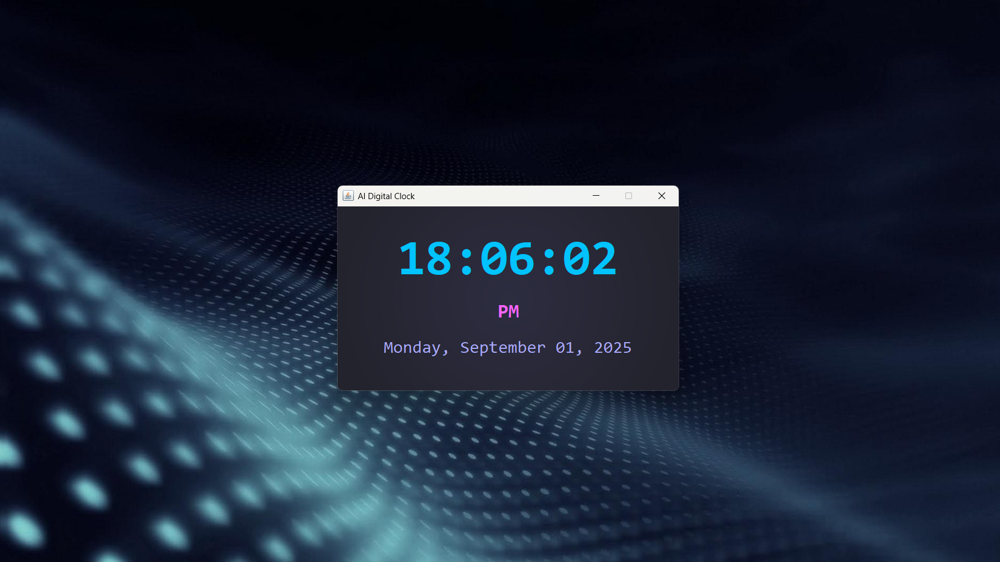

# AI-Themed Digital Clock

A stylish digital clock application built with Java Swing featuring a futuristic AI-inspired user interface.

## Features

- Real-time digital clock display with hours, minutes, and seconds
- Current date display with day of week, month, day, and year
- AM/PM indicator
- Sleek AI-themed UI with custom colors and glow effects
- Modern, clean interface with a futuristic feel

## Main Screen Digital Clock


(Screenshot will be available after running the application)

## Requirements

- Java Runtime Environment (JRE) 8 or higher
- Java Development Kit (JDK) 8 or higher (for compilation)

## How to Run

### Method 1: Compile and Run from Command Line

1. Open a terminal/command prompt
2. Navigate to the project directory
3. Compile the Java file:
   ```
   javac DigitalClock.java
   ```
4. Run the application:
   ```
   java DigitalClock
   ```

### Method 2: Run in an IDE

1. Open the project in your favorite Java IDE (Eclipse, IntelliJ IDEA, NetBeans, etc.)
2. Open the `DigitalClock.java` file
3. Run the file using the IDE's run function

## Customization

You can customize the clock by modifying the following constants in the `DigitalClock.java` file:

- `BG_COLOR`: Background color of the application
- `TIME_COLOR`: Color of the time display
- `DATE_COLOR`: Color of the date display
- `AMPM_COLOR`: Color of the AM/PM indicator
- `PANEL_COLOR`: Color of the main panel

##  License

This project is licensed under the MIT License - see the [LICENSE](LICENSE) file for details.

##  Author

**Saurabh**
-  Portfolio: [saurabhh.in](https://saurabhh.in)
-  Email: Saurabh@wearl.co.in


---

⭐ **Star this repository if you find it helpful!** ⭐